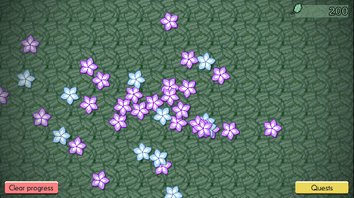
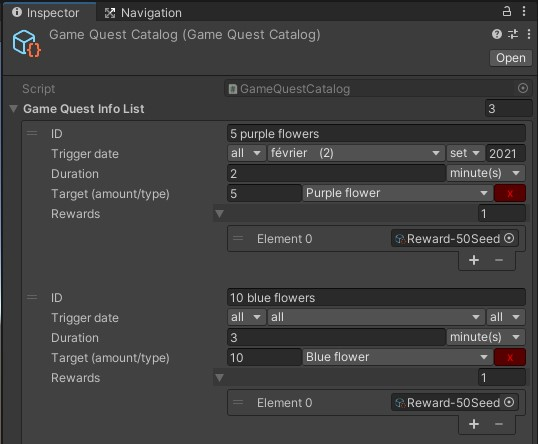
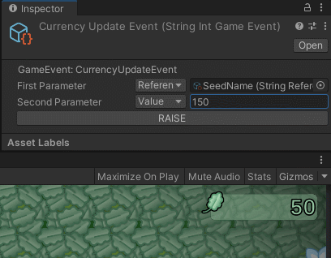

# Game Quest

GameQuest provides an easy way to create quests for a game, and the management of them.



## Usage

A game quest has the following default data:
- **identifier**: must be a unique identifier of the quest
- **trigger date**: any or specific day, month and/or year
- **duration**: how long this quest is alive when launched
- **target**: its main target, with the target id and an amount to reach
- **list of rewards**: player currency reward is provided, you can add any reward you want

Use the Sample demo to help you understand the system, it's not so easy.

### Steps from scratch



1. Create a game quest catalog with id, trigger date, duration, target (amount and id) as shown above. There's a drawer to help you input those data.
2. Add rewards from existing sample reward (player currency) or create your own reward, a class that has to derive from the GameQuestReward scriptable object class.
2. Use methods in the GameQuestManager to retrieve quests and update them (launch, complete, etc)
3. The quest progress is automatically saved using the GameQuestSavedData with the PersistentDataSystem

#### To launch a quest

Quests are *Locked* by default when there is no progress saved. You can directly launch them or put them in a *WaitingForEnable* status so the player can see only those quests and launch them from the UI.

```C#
GameQuestManager.Instance.LaunchQuest(questInfo, questProgress);
```

### To validate a quest

Once the progress of a quest reaches the target, call the *ValidateQuest* method to validate it. It will directly gives the reward if the manager is configured so, or put it in the *WaitingForReward* state so the reward can be given when the player does a specific action (like a tap on the UI or the opening of a lootbox).

```C#
GameQuestManager.Instance.ValidateGameQuest(questInfo, questInfo.runtimeQuestProgress);
```

### Demo - Flower quests

In this demo, the player has to grab (click/tap) flowers to retrieve seeds (which is the virtual currency of this game).
Three quests are available, only the first one is enabled by default when you launch the game, the other one are enabled 5 and 10 minutes later.

#### Quest progress

You can see the progress of the quests by clicking on the **Quests** button in the bottom right.
Only the available and not completed quests are shown in this popup.

#### Events

Events are fired when a quest changes status. Each status has a different event so you can subscribe only to those who you have interest in. Events are done so you can test their usage using the inspector as shown below.



When a reward is obtained, an event with the reward is also fired. In this demo, the reward is a player currency reward, but the event is not used directly by the UI. Instead, the *currency update* event is used to reflect the final status.

